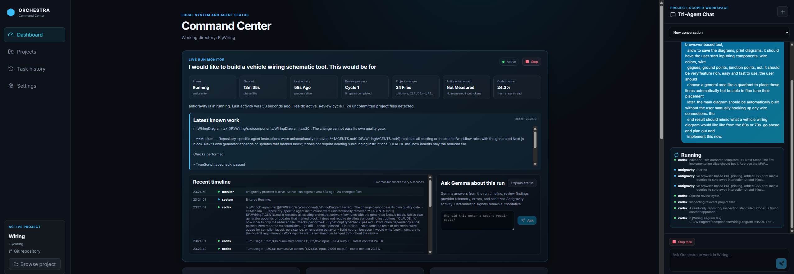
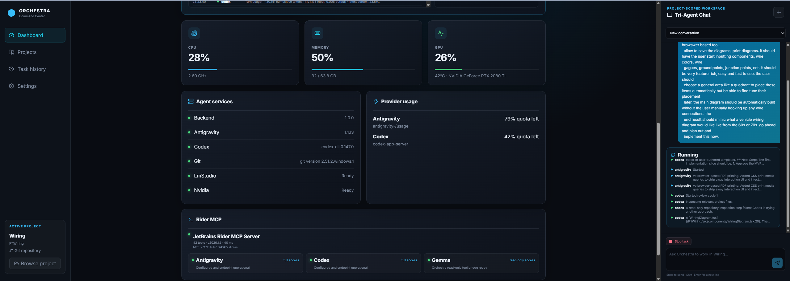

# Antigravity Orchestra

Antigravity Orchestra is a Windows-first, local command center for running a project-scoped software-development workflow across three AI agents:

- **Gemma in LM Studio** classifies requests, answers bounded repository questions, validates results, and explains active runs.
- **Google Antigravity** researches and implements changes.
- **OpenAI Codex** provides independent design, debugging, and code review.

You select a project directory once and work from Orchestra's web dashboard. Each request is routed automatically, every agent is pinned to that directory, and file-changing tasks continue through implementation, review, repair, verification, commit, and push without requiring you to launch separate CLIs in the project folder.

> **Status:** Active local development. The dashboard is functional and used for real projects, but provider CLIs and their structured output formats are still evolving.

## Dashboard

### Live task execution



The run monitor shows the current phase, active agent, elapsed time, review cycle, changed files, recent timeline, provider context, and sanitized agent activity. You can ask Gemma questions about the active run without interrupting it.

### System, quota, and MCP status



The dashboard tracks local system load, agent availability, provider quota, and JetBrains Rider MCP health. Rider is probed with a real MCP initialization and tool-list exchange rather than being considered healthy merely because a configuration file exists.

## What Orchestra Does

- Keeps every conversation and task attached to an explicit project directory.
- Routes simple repository questions to the local Gemma model when evidence is sufficient.
- Escalates design, debugging, testing, and review work to Codex.
- Sends Codex analysis to Antigravity for implementation.
- Runs independent Codex review after changes are made.
- Automatically returns blocking findings to Antigravity for repair.
- Runs bounded project verification before accepting a change set.
- Creates a handoff entry, commits reviewed files, and pushes through Git.
- Preserves partial task changes after failures or dashboard restarts.
- Shows live task health, repair cycles, changed files, context pressure, and quota.
- Detects Rider MCP availability separately for Antigravity, Codex, and Gemma.
- Supports a least-privilege, read-only Rider tool bridge for Gemma.
- Performs narrowly validated local operations, such as connecting a clean project to an empty GitHub remote, without wasting a three-agent cycle.

## Automatic Workflow

```text
User request
    |
    v
Gemma classification and routing
    |
    +-- safe, small repository question --> Gemma evidence answer
    |
    +-- bounded local operation ----------> Orchestra adapter
    |
    +-- design/debug/review --------------> Codex specialist
                                                |
                                                v
                                      Antigravity implementation
                                                |
                                                v
                                          Codex review
                                                |
                              +-----------------+-----------------+
                              |                                   |
                         blocking finding                       pass
                              |                                   |
                              v                                   v
                     Antigravity repair                 verification + Git
```

Explicit implementation language is normalized deterministically, so a model cannot accidentally turn “plan and implement” into a read-only task. Short approvals such as `proceed`, `continue`, and `do it` inherit the preceding completed task in the same conversation. A mutating task that produces no project changes is retried once and is never reported as successfully completed without evidence of implementation.

## Agent Responsibilities

| Agent | Primary responsibilities | Project authority |
|---|---|---|
| Gemma | Classification, bounded repository answers, postflight checks, summaries, run explanations | Read-only evidence and allowlisted Rider inspection tools |
| Antigravity | Repository research, implementation, repairs, synchronous verification | File changes within the selected project |
| Codex | Architecture, root-cause analysis, test design, independent review | Read-only analysis |
| Orchestra | Task state, project isolation, recovery, verification, commits, pushes, telemetry | Validated local adapters and dashboard-owned Git finalization |

Model selection is automatic. Deep or sensitive design work can use stronger reasoning profiles; small work can use faster models, and quota pressure may move only non-critical work to a cheaper model. Ordinary implementation reviews use Terra High with a bounded diff-first packet. Orchestra escalates review to Sol High for sensitive requests, high-risk Gemma triage, very large change sets, or repeated repair cycles. Required design and review roles are not skipped merely to save quota.

## Context and Quota Awareness

Codex runs through its app-server protocol, allowing Orchestra to record the current thread, turn, context-window use, token activity, cancellation, and quota. Each Codex role and review cycle starts with a fresh ephemeral thread.

Antigravity usage is collected from its supported usage output and stream telemetry. When an authoritative context percentage is unavailable, Orchestra says so rather than inventing one. Large prior turns can cause Orchestra to rotate the provider conversation while retaining compact local session memory.

## Rider MCP

Orchestra currently provides:

- Live server identity, version, endpoint, latency, and tool count.
- Agent-specific configured, enabled, available, and access states.
- Full native Rider MCP configuration for Antigravity.
- Native Rider MCP configuration for Codex, while Codex remains instruction-bound to read-only work.
- A loopback-only Gemma bridge exposing a bounded allowlist of read-only Rider tools.

At task start, Orchestra probes Rider once and gives each agent capability-aware instructions only when that agent's connection is healthy. Antigravity is encouraged to use Rider for solution-aware implementation work, Codex for read-only semantic inspection, and Gemma for its bounded repository-inspection tools. Actual Rider calls and outcomes appear in the recent timeline without exposing tool arguments. Agents still use Git and shell tools when those are the better fit; Rider is preferred where useful, not forced for every operation.

## Git Safety and Recovery

File-changing tasks require a Git repository. Orchestra:

1. Detects pre-existing changes and requires a separate reviewed baseline.
2. Keeps `.orchestra/`, logs, caches, and generated state out of project commits.
3. Prevents agents from owning final commits or pushes.
4. Reviews the complete uncommitted change set with Codex.
5. Runs detected project checks synchronously.
6. Adds a `docs/HANDOFF.md` entry.
7. Commits only the reviewed project paths and pushes the current branch.

If Antigravity stalls, times out, exits nonzero, or returns an incomplete terminal result during a file-changing turn, Orchestra does not accept the provider response as completion. Five minutes without provider stream activity triggers early takeover rather than waiting for the absolute timeout. Gemma classifies the observed failure. A preserved diff transfers directly to independent Codex review; a no-diff failure goes to Codex diagnosis before a fresh Antigravity foreground retry. Repeated no-progress repairs receive an escalated review and one alternate fresh repair. A passing Codex review is followed by deterministic project verification; concrete lint, build, or test failures re-enter the bounded Antigravity repair and Codex review loop automatically. On Windows, Orchestra invokes npm through Node's CLI entry point to avoid the Node 24 `spawn EINVAL` cmd-script failure. Dashboard restarts, unsafe repository state, direct provider commits, exhausted bounded failovers, or other cases where safe automatic progress is no longer possible preserve changes and expose a recovery action. Recovery keeps the same task's ownership instead of misclassifying partial files as an unrelated baseline.

A short continuation command such as `continue`, `proceed`, or `go ahead` resumes the session's existing `recovery_required` task directly, even if a newer summary task exists. It does not create a separate task or reclassify the preserved files as baseline changes. Local Gemma answers are rejected when their answer or limitations explicitly defer requested work to a later step.

## Requirements

### Required

- Windows 10 or 11
- PowerShell 5.1 or newer
- Node.js 22 or newer and npm
- Git
- Google Antigravity CLI (`agy`), authenticated
- OpenAI Codex CLI, authenticated
- LM Studio with its OpenAI-compatible server enabled
- `gemma-4-e2b-it-qat` loaded by default, or `LM_STUDIO_MODEL` set to another tool-capable local model

### Optional

- JetBrains Rider with its MCP server enabled
- NVIDIA GPU for local-model and system telemetry
- A GitHub remote for automatic push finalization

## Quick Start

```powershell
git clone https://github.com/frankr2994/antigravity-orchestra.git
Set-Location .\antigravity-orchestra
.\Start-Orchestra.ps1
```

The launcher installs dashboard dependencies when needed and starts both the local API and Vite dashboard. Open the URL printed by Vite, normally:

```text
http://127.0.0.1:5173
```

Then:

1. Select **Browse project** and choose the repository you want the agents to use.
2. Review onboarding status and any existing-change warning.
3. Create or select a conversation.
4. Enter the complete request once; Orchestra owns routing and continuation.
5. Follow the live monitor, or ask Gemma about the run while it remains active.

The backend listens only on loopback by default and uses a per-process dashboard token for state-changing API requests.

## Configuration

| Environment variable | Default | Purpose |
|---|---|---|
| `ORCHESTRA_PORT` | `3001` | Local API port |
| `ORCHESTRA_DATA_DIR` | `%LOCALAPPDATA%\AntigravityOrchestra` | SQLite database and runtime state |
| `ORCHESTRA_TEMPLATE_ROOT` | Repository root | Managed project-onboarding template |
| `LM_STUDIO_BASE_URL` | `http://127.0.0.1:1234/v1` | LM Studio OpenAI-compatible API |
| `LM_STUDIO_MODEL` | `gemma-4-e2b-it-qat` | Local routing and monitoring model |

Runtime conversations and task events are stored in SQLite under the local application-data directory, not in the selected project.

## Development

```powershell
Set-Location .\orchestra-dashboard
npm install
npm run dev
```

Run the complete quality gate with:

```powershell
npm run check
```

This runs linting, the TypeScript/server and Vite production builds, and the Node regression suite.

## Repository Layout

```text
orchestra/
|-- Start-Orchestra.ps1          # supported dashboard launcher
|-- orchestra-dashboard/
|   |-- src/                     # React command center
|   |-- server/                  # Express API, routing, agents, Git, MCP
|   |-- scripts/                 # development and telemetry helpers
|   `-- tests/                   # routing, recovery, protocol, and Git tests
|-- .agents/                     # Antigravity rules, workflows, and skills
|-- .codex/                      # Codex role boundary
|-- docs/
|   |-- DESIGN.md                # architecture decision history
|   |-- HANDOFF.md               # incremental implementation handoff
|   `-- images/                  # README screenshots
`-- examples/                    # example project material
```

## Current Limitations

- Windows is the supported host platform today.
- The dashboard is designed for a trusted, single-user loopback environment.
- Antigravity's context percentage is shown only when a trustworthy provider source is available.
- Codex command failures expose a bounded, credential-redacted reason when the protocol supplies one; unknown schemas still fall back to a generic safe notice.
- Rider usage reporting depends on the agents' evolving event schemas. Unrecognized tool events may not appear even when the health probe succeeds.
- MCP enable/disable management is not yet exposed in the UI.
- Real-time multi-user collaboration is out of scope.

## Documentation

- [Architecture decisions](docs/DESIGN.md)
- [Current handoff](docs/HANDOFF.md)
- [Execution walkthrough](docs/walkthrough.md)
- [Legacy Japanese guide](README.ja.md)

## License

[MIT](LICENSE)

## Acknowledgments

The original repository was inspired by Claude Code Orchestra and the Antigravity/Codex delegation pattern. This fork has evolved into a project-scoped tri-agent command center with local-model routing, automatic review and repair, observability, recovery, Git finalization, and MCP health monitoring.
